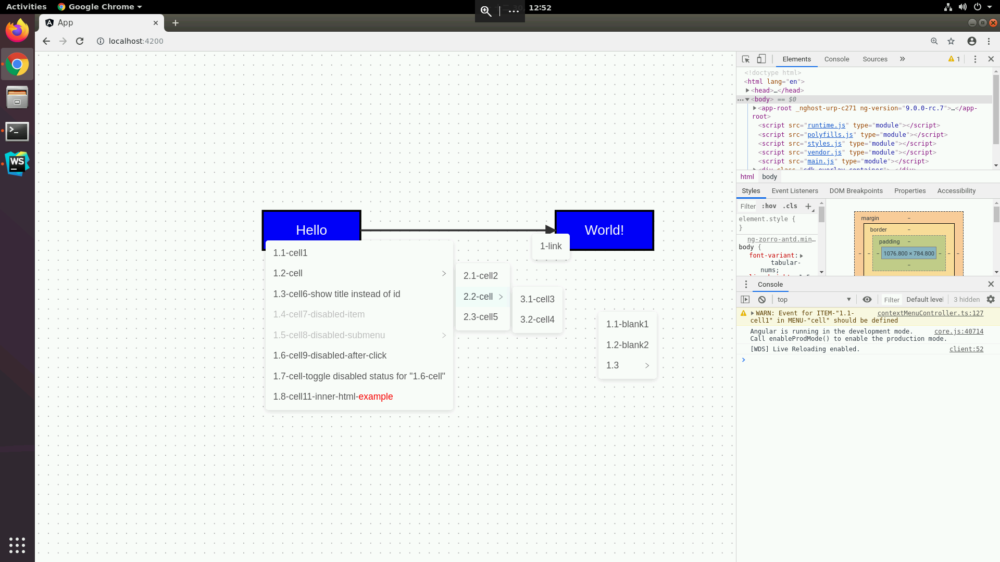
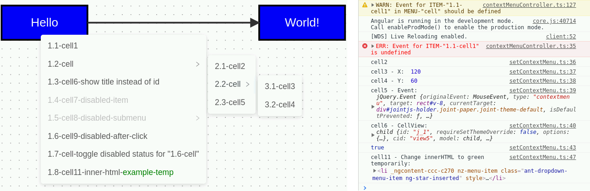

# ContextMenu for JointJS | Angular & NG-ZORRO
## About
### - Screenshot


### - Environment
* Upgrade to stable version when available
  + [Angular@~9.0.0-rc.7](https://www.npmjs.com/package/@angular/cli/v/9.0.0-rc.7)
  + [JointJs@~3.1.1](https://www.npmjs.com/package/jointjs/v/3.1.1)
  + [ng-zorro-antd@~8.5.2](https://www.npmjs.com/package/ng-zorro-antd/v/8.5.2)
    - [@9.0.0-beta.0](https://www.npmjs.com/package/ng-zorro-antd/v/9.0.0-beta.0) is available but not used

### - ☆ TL;DR
1. Know how do the [joint.dia.Paper.events](https://resources.jointjs.com/docs/jointjs/v3.1/joint.html#dia.Paper.events) work
    + I.e., `cell:contextmenu`, `link:contextmenu`, `element:contextmenu`, and `blank:contextmenu`
      - `cell`=vertex+edge; `element`=vertex; `link`=edge; `blank`=paper-cell
2. Meet the [prerequisites](#--prerequisite) (import library, predefine context menu, component initialize, bind event, etc.)
3. Try the [demo](#--demo) ฅ• ω •ฅ

### - Demo


* All demos are shown using [`cell:contextmenu`](app/src/app/joint-contextmenu/setContextMenu.ts#L13-L51)
  1. `1.1-cell1`: [No](app/src/app/joint-contextmenu/setContextMenu.ts#L33-L35) binding event, which will raise [**warning**](app/src/static/ts/libraries/ContextMenuController/contextMenuController.ts#L127) when init and [**error**](app/src/static/ts/libraries/ContextMenuController/contextMenuController.ts#L35) when click (as screenshot)
  2. `2.1-cell2`: Console log only
  3. `3.1-cell3`: [Empty children](app/src/app/joint-contextmenu/setContextMenu.ts#L20) (which requires binding event and won't be render as submenu); EventInfo - X-axis
  4. `3.2-cell4`: EventInfo - [Y-axis](app/src/app/joint-contextmenu/setContextMenu.ts#L38) (where user did the `right click`)
  5. `2.3-cell5`: EventInfo - JointJS [jQuery Event](app/src/app/joint-contextmenu/setContextMenu.ts#L39) (the context menu event)
  6. `1.3-cell6`: Show [title instead of id](app/src/app/joint-contextmenu/setContextMenu.ts#L25); EventInfo - [CellView](app/src/app/joint-contextmenu/setContextMenu.ts#L40) (the cell user right clicked on) (undefined for `blank` event)
  7. `1.4-cell7-disabled-item`: [Disabled](app/src/app/joint-contextmenu/setContextMenu.ts#L26) menu item
  8. `1.5-cell8-disabled-submenu`: Disabled submenu (children in the menu are still enabled but unreachable)
  9. `1.6-cell9-disabled-after-click`: Always [disable](app/src/app/joint-contextmenu/setContextMenu.ts#L44) itself when click
      - Return and [print](app/src/app/joint-contextmenu/setContextMenu.ts#L43) `true` if the given id was found and disabled status was set
  10. `1.7-cell10-toggle-disabled`: Switch cell9 [between](app/src/app/joint-contextmenu/setContextMenu.ts#L45) enabled and disabled
  11. `1.8-cell11-inner-html`: InnerHtml [rendering](app/src/app/joint-contextmenu/joint-contextmenu.component.html#L14) and [changing](app/src/app/joint-contextmenu/setContextMenu.ts#L48)
      - `eventInfo.menuItem`=the mouse click event; `(eventInfo.menuItem.target as HTMLElement)`=the menu item

## HOW-TO
### - Run
1. `$ ./run_app.sh`
2. Visit http://localhost:4200/

### - Prerequisite
1. Prepare [placeholder](app/src/app/joint-contextmenu/joint-contextmenu.component.html#L2-L19) for context menu in `*.component.html`
2. [Import](app/src/app/joint-contextmenu/joint-contextmenu.component.ts#L1-L5) things in `*.component.ts`
    + Services, components, and predefined context menus
3. [Declare](app/src/app/joint-contextmenu/joint-contextmenu.component.ts#L15-L16) and [bind](app/src/app/joint-contextmenu/joint-contextmenu.component.ts#L51-L54) target paper, component, and service in `*.component.ts`
4. [Predefine](app/src/app/joint-contextmenu/setContextMenu.ts#L10-L95), [bind](app/src/app/joint-contextmenu/setContextMenu.ts#L101-L104) menus with events, and [export](app/src/app/joint-contextmenu/setContextMenu.ts#L97-L100) context menus in `yourMenus.ts`

### - Implementation
#### Library ([contextMenuController.ts](app/src/static/ts/libraries/ContextMenuController/contextMenuController.ts))
1. Public APIs
    + [`menu: ContextMenu`](app/src/static/ts/libraries/ContextMenuController/contextMenuController.ts#L13-L17): For HTML rendering
    + [`onClick(id: string, $eventOnMenuItem?: MouseEvent): void`](app/src/static/ts/libraries/ContextMenuController/contextMenuController.ts#L24-L37): Callback events for menu items [clicking](app/src/app/joint-contextmenu/joint-contextmenu.component.html#L13)
      - `eventOnMenuItem`: The mouse click event (`$event`) for menu item (`left click`)
    + [`disableMenuItem(menuType: MenuType, targetId: string, setAsDisabled?: boolean): boolean`](app/src/static/ts/libraries/ContextMenuController/contextMenuController.ts#L39-L62): Set menu item status
      - `setAsDisabled`: `true`=disabled, `false`=enabled, `leave empty`=toggle
    + [`bind(contextMenuInfo: ContextMenuInfo): void`](app/src/static/ts/libraries/ContextMenuController/contextMenuController.ts#L64-L90)
      - [Bind](app/src/app/joint-contextmenu/joint-contextmenu.component.ts#L51-L54) target [paper](app/src/app/joint-contextmenu/joint-contextmenu.component.ts#L14), [nzContextMenuService](app/src/app/joint-contextmenu/joint-contextmenu.component.ts#L16), and Menu Template ([@ViewChild](app/src/app/joint-contextmenu/joint-contextmenu.component.ts#L15))
    + [`unbind(menuType?: MenuType): void`](app/src/static/ts/libraries/ContextMenuController/contextMenuController.ts#L92-L106): Reserved. Not used in the demo
      - `leave empty`=unbind all 4 kinds of bound events
    + [`bindContextMenuWithEvents(menuType: MenuType, contextMenu?: ContextMenu, clickEvents?: ClickEvents)`](app/src/static/ts/libraries/ContextMenuController/contextMenuController.ts#L108-L132)
      - [(Re)bind](app/src/app/joint-contextmenu/setContextMenu.ts#L101-L104) predefined [context menus](app/src/app/joint-contextmenu/setContextMenu.ts#L15-L31) and [events](app/src/app/joint-contextmenu/setContextMenu.ts#L32-L50)
2. Private function
    + [`private extractIdAndEvent(contextMenu: ContextMenu): ClickEvents`](app/src/static/ts/libraries/ContextMenuController/contextMenuController.ts#L143-L167)
      - Extract leaf menu items (as expected events) for the following [binding check](app/src/static/ts/libraries/ContextMenuController/contextMenuController.ts#L123-L129) 
#### Example ([setContextMenu.ts](app/src/app/joint-contextmenu/setContextMenu.ts))
* See [Demo](#--demo)
  + Note that there's no context menu for [`element`](app/src/app/joint-contextmenu/setContextMenu.ts#L53-L54) in this demo but use `cell` instead
    - However, in practice, user should use `element` and `link` separately rather than use `cell` for both because they usually have different context menu
  + You are encouraged to define your own [interface to combine MenuAndEvent](app/src/app/joint-contextmenu/setContextMenu.ts#L5-L8) to increase readability, but it's not required by the library
#### Angular related
1. [`*.component.html`](app/src/app/joint-contextmenu/joint-contextmenu.component.html)
    + Remember to put the [placeholder](app/src/app/joint-contextmenu/joint-contextmenu.component.html#L2-L19) for contextmenu
      - [Set menu item](app/src/app/joint-contextmenu/joint-contextmenu.component.html#L3) as [unselectable](app/src/app/joint-contextmenu/joint-contextmenu.component.scss#L2-L8) and disable right click on menu items (return false)
      - [Bind click events](app/src/app/joint-contextmenu/joint-contextmenu.component.html#L13) and allow using [innerHTML](app/src/app/joint-contextmenu/joint-contextmenu.component.html#L14)
    + Copy following html code into your `*.component.html`
      ```html
      <nz-dropdown-menu #contextMenuPlaceholder="nzDropdownMenu">
        <ul nz-menu class="unselectable" oncontextmenu="return false;">
          <ng-container *ngTemplateOutlet="recursiveContextMenu; context:{ $implicit: contextMenu.menu }"></ng-container>
          <ng-template #recursiveContextMenu let-menuItems>
            <ng-container *ngFor="let item of menuItems">
              <li *ngIf="item.children?.length > 0; else leaf" nz-submenu [nzTitle]="item.title || item.id" [nzDisabled]="item.disabled">
                <ul class="unselectable" oncontextmenu="return false;">
                  <ng-container *ngTemplateOutlet="recursiveContextMenu; context:{ $implicit: item.children }"></ng-container>
                </ul>
              </li>
              <ng-template #leaf>
                <li nz-menu-item (click)="contextMenu.onClick(item.id, $event)"
                    [nzDisabled]="item.disabled" [innerHTML]="item.title || item.id"></li>
              </ng-template>
            </ng-container>
          </ng-template>
        </ul>
      </nz-dropdown-menu>
      ```

2. [`*.component.ts`](app/src/app/joint-contextmenu/joint-contextmenu.component.ts)
    + See [prerequisite](#--prerequisite) 2 & 3
      - Note that you have to bind `contextMenuComponent` within [`ngAfterViewInit()`](app/src/app/joint-contextmenu/joint-contextmenu.component.ts#L53)
3. [`yourMenus.ts`](app/src/app/joint-contextmenu/setContextMenu.ts)
    + [Declare](app/src/app/joint-contextmenu/setContextMenu.ts#L10-L95) context menus and corresponding events and [bind](app/src/app/joint-contextmenu/setContextMenu.ts#L101-L104) them to the controller
    + [Import](app/src/app/joint-contextmenu/joint-contextmenu.component.ts#L5) and [assign](app/src/app/joint-contextmenu/joint-contextmenu.component.ts#L13) as public for HTML rendering
4. [`*.pollution.scss`](app/src/static/scss/joint-contextmenu.pollution.scss)
    + You CANNOT use `style` in innerHTML due to the [security policies](https://angular.io/guide/security#sanitization-and-security-contexts) of Angular
      - Therefore, you have to use `class` instead
      - However, you will face [`ViewEncapsulation` issue](app/src/static/scss/entry.pollution.scss#L1-L2) in angular
      - Workaround: Declare those `*.pollution` CSS [explicitly](app/src/static/scss/joint-contextmenu.pollution.scss), creat an [entry point](app/src/static/scss/entry.pollution.scss#L3), and import it in [`styles.scss`](master/app/src/styles.scss#L2)

## License
* This project is licensed under the MIT License
  + Feel free to modify it as your own version if needed
  + Contact me if having any comments :D

